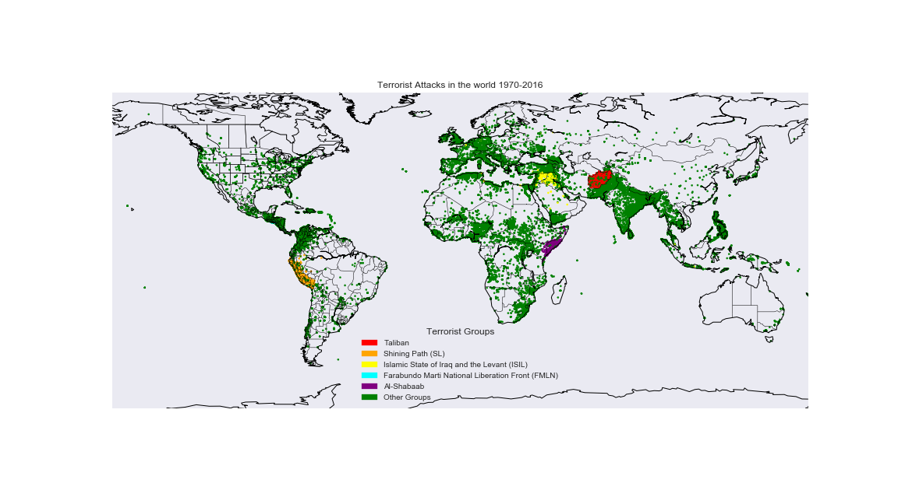

# Machine Learning for Counterterrorism 



## Purpose  

In this project, we sought to analyze what factors lead terrorist attacks to succeed, as well as historical trends and patterns in the database of terrorist attacks. 

**Authors**: Akhil Jalan, Paul Kim, Yakub Akhmenerov 

{akhiljalan, luapkim, yakubakh} @berkeley.edu

## Instructions 

### Installation Instructions 

After cloning the repository to your machine, simply run the following commands from your terminal. 

```
make env
source activate ct_env
make test
make run
```

### Navigating the Repo

The notebook ```main.ipynb``` contains a summary and exposition of our work. We recommend you start there, and then branch out to whatever interests you. Each notebook is largely self-contained and does not depend on the others. 

The notebooks ```counter_terrorism_random_forest.ipynb```, ```counter_terrorism_lasso.ipynb```, and ```counter_terrorism_neural_network.ipynb``` contain work for our random forest, LASSO regression, and neural network models respectively. 

The notebooks ```counter_terrorism_nb1.ipynb```, ```counter_terrorism_nb2.ipynb```, and ```counter_terrorism_nb3.ipynb``` contain exploratory analysis and data visualization. Not all of the visualizations were used in ```main.ipynb```. The directory ```figures/``` contains all of the visualizations we used in ```main.ipynb```, and some that we didn't. 

The file ```preprocess_functions.py``` contains some basic functions for loading and pre-processing the data, and similarly ```utils.py``` contains useful functions for the notebooks. Unit tests are in ```tests.py```. 

```instructions.md``` is not relevant to users. It contains directions written for us by our GSI/professor. 

The directory ```intermediate_results``` contains some intermediate data used across notebooks. 

## Dataset 

We used a database of 170,350 terrorist attacks from 1970 to 2016 created by researchers at the University of Maryland.

The stored the data in the form of two CSV files in the ```data/``` directory: ```globalterrorismdb_0617dist_1.csv``` and ```globalterrorismdb_0617dist_2.csv```. The original dataset came as one large CSV file, but splitting it was necessary to upload to Github. Other than this split, we did not modify the contents of the CSV files.

#### Source

The database is maintained by researchers at the National Consortium for the Study of Terrorism and Responses to Terrorism (START), headquartered at the University of Maryland. For more details, see [their website](http://start.umd.edu/gtd/). 

The data are also hosted on [Kaggle](https://www.kaggle.com/abigaillarion/terrorist-attacks-in-united-states/data). 

#### Details 
For convenience, we've copy-pasted information about the dataset from the Kaggle competition site. We highly recommend looking at the [GTD Codebook](http://www.start-dev.umd.edu/gtd/downloads/Codebook.pdf) for important details on data collection methodology, definitions, and coding schema.

**Geography**: Worldwide

**Time period**: 1970-2016, except 1993 (2017 in progress, publication expected June 2018)

**Unit of analysis**: Attack

**Variables**: >100 variables on location, tactics, perpetrators, targets, and outcomes

**Sources**: Unclassified media articles (Note: Please interpret changes over time with caution. Global patterns are driven by diverse trends in particular regions, and data collection is influenced by fluctuations in access to media coverage over both time and place.)

**Definition of terrorism**:

"The threatened or actual use of illegal force and violence by a non-state actor to attain a political, economic, religious, or social goal through fear, coercion, or intimidation."

## Licensing

This work is under the MIT License. 

Copyright (c) 2017 Reproducible and Collaborative Statistical Data Science

Permission is hereby granted, free of charge, to any person obtaining a copy of this software and associated documentation files (the "Software"), to deal in the Software without restriction, including without limitation the rights to use, copy, modify, merge, publish, distribute, sublicense, and/or sell copies of the Software, and to permit persons to whom the Software is furnished to do so, subject to the following conditions:

The above copyright notice and this permission notice shall be included in all copies or substantial portions of the Software.

THE SOFTWARE IS PROVIDED "AS IS", WITHOUT WARRANTY OF ANY KIND, EXPRESS OR IMPLIED, INCLUDING BUT NOT LIMITED TO THE WARRANTIES OF MERCHANTABILITY, FITNESS FOR A PARTICULAR PURPOSE AND NONINFRINGEMENT. IN NO EVENT SHALL THE AUTHORS OR COPYRIGHT HOLDERS BE LIABLE FOR ANY CLAIM, DAMAGES OR OTHER LIABILITY, WHETHER IN AN ACTION OF CONTRACT, TORT OR OTHERWISE, ARISING FROM, OUT OF OR IN CONNECTION WITH THE SOFTWARE OR THE USE OR OTHER DEALINGS IN THE SOFTWARE.

## Acknowledgments

The authors would like to thank Professor Fernando Perez and our GSI Eli Ben-Michael for their support and guidance. We would also like to thank the START team at the University of Maryland for making this dataset freely available.
